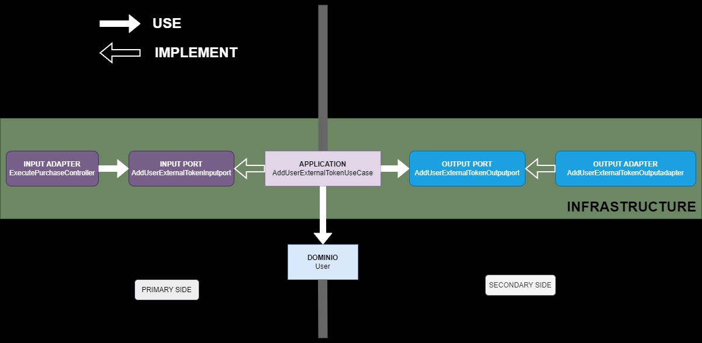

# Paycomet Challenge Code

Paycomet payment integration in Laravel 11 with hexagonal architecture

## Hexagonal architecture example

Added concept of primary side and secondary side in the application.

## Launch application
1. Open terminal.
2. Download the repository: `git clone https://github.com/palatinum/CodeChallengePaycomet.git`
3. Enter the project directory: `cd CodeChallengePaycomet`
4. Create the .env: `cp .env.example .env` and add the environment variables necessary for the connection.
5. Run docker: `docker compose up -d`
6. Run dependency installation: `docker exec -it paycomet-app composer install`
7. Run migrations: `docker exec -it paycomet-app php artisan migrate`
8. Open in browser [http://localhost](http://localhost).
